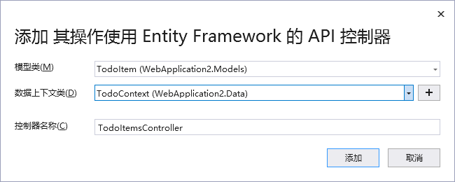

# ASP.NET Core项目文件

> 整个项目文件是以.csproj作为文件的扩展名的

```xml
<Project Sdk="Microsoft.NET.Sdk.Web">

  <PropertyGroup>
    //目标框架、选择托管形式 InProcess（进程内托管） OutOfProcess（进程外托管）、进程内托管比进程外托管提供了更高的请求吞吐量
    <TargetFramework>netcoreapp3.1</TargetFramework>
    <AspNetCoreHostingModel>InProcess</AspNetCoreHostingModel>
  </PropertyGroup>

  <ItemGroup>
    //用于包含对应用程序安装的nuget包的引用
  	<PackageReference></PackageReference>
  </ItemGroup>
</Project>
```

> 进程内托管


> 进程外托管


| 进程内                               | 进程外                              |
| ------------------------------------ | ----------------------------------- |
| 进程名称“w3wp.exe”或"iisexpress.exe" | 进程名称"dotnet.exe"                |
| 只有一个服务器                       | 两台服务器                          |
| 性能更好                             | 在内部和外部Web服务器之间代理请求的 |

# 项目结构解析

> Program.cs（项目入口）

```c#
//项目的主入口
public static void Main(string[] args)
{
    CreateHostBuilder(args).Build().Run();
}

//设置Web服务器，加载主机和应用程序配置表信息，配置日志记录
public static IHostBuilder CreateHostBuilder(string[] args) =>
    Host.CreateDefaultBuilder(args)
    .ConfigureWebHostDefaults(webBuilder =>
                              {
                                  webBuilder.UseStartup<Startup>();
                              });
```

> Startuo.css

```c#
public void ConfigureServices(IServiceCollection services);
```

1. mvc（下文中详解）
2. 添加依赖注入服务（将接口和实现类一一绑定）==低耦合、提供了高测试性，使单元测试更加容易==
   - services.AddSingleton
   - services.AddTransient
   - services.AddScoped

```c#
public void Configure(IApplicationBuilder app, IWebHostEnvironment env);
```


>  lauchSettings.json

```json
{
  "$schema": "http://json.schemastore.org/launchsettings.json",
  "iisSettings": {
    "windowsAuthentication": false,
    "anonymousAuthentication": true,
    "iisExpress": {
      "applicationUrl": "http://localhost:50571",
      "sslPort": 0
    }
  },
  "profiles": {
    "IIS Express": {
      "commandName": "IISExpress",
      "launchBrowser": true,
      "launchUrl": "weatherforecast",
        //生产环境
      "environmentVariables": {
        "ASPNETCORE_ENVIRONMENT": "Development"
      }
    },
    "EM.Guba.Backend.Share": {
      "commandName": "Project",
      "dotnetRunMessages": "true",
      "launchBrowser": true,
      "launchUrl": "weatherforecast",
      "applicationUrl": "http://localhost:5000",
        //生产环境
      "environmentVariables": {
        "ASPNETCORE_ENVIRONMENT": "Development"
      }
    }
  }
}

```

> ASP.NET Core 中的配置源：
>
> - appsettings.json，appsettings.{Environment}.json，不同环境中对应不同的托管环境
> - User secrets（用户机密）
> - Environment variables（环境变量）
> - Command-line arguments（命令行参数）

# 实际项目开发

> 添加依赖

- 依赖一般从common中进行引入
- 工具类库为EM.Guba.Lib.Utils
-  ==common中的依赖项并不会被打包成dll，所以业务模块中需要重新引入==
- 直接引入项目虽然可以运行但是文件打开速度会被拖慢


- 一般选用生成dll文件引入

生成dll步骤为对项目右键


> 项目结构

- model 实体类
- data 数据层操作（dao）
- core 业务层操作

> 返回的数据类型：

- JsonResult
- ObjectResult
- IActionResult view
  - 视图文件具有.cshtml的拓展名
  - 视图文件是带有嵌入Razor标记的HTML模板
  - 可能包含Controller提供给它的Model的业务数据

> controllers



# 难点

## ConfigureServices and Configure


> configureServices 是一个容器，所使用的服务及方法要添加到公共的容器之中， Configure是ConfigureServices中注册进来的所有服务要在Configure之中进行使用
>
> - 将所需的MVC服务添加到asp.net.core的依赖注入到容器中
> - 添加MVC中间件到我们的请求处理管道中


## AddMvc/AddMvcCore/AddControllers等区别

> 1. services.AddMvcCore()
>
>    - 只注册路由请求和执行控制器所必要的核心服务，确保Pipeline程序可运转。==提供的功能很少，需要DIY很多功能==
>
> 2. services.AddControllers()
>
>    - 除包含了AddMvcCore()所有功能，再加上：
>     - Authorization
>      - ApiExplorer
>      - Data Annotation
>      - Formatter Mapping
>      - CORS
> 
>    ==要用Controller但不用View，新建WebAPI时，默认采用==
>
> 3. services.AddRazorPages()
>
>    - 包含AddMvcCore()所有功能，再加上
>     - Razor Pages
>      - Authorization
>      - Data Annotation
>      - Cache Tag Helper
> 
> 4. services.AddControllersWithViews()
>
>    - 包含AddControllers()所有功能，再加上：
>     - cshtml和Razor View
>      - Cache Tag Helper
> 
>    ==标准MVC模式，常用Razor视图，使用这个足够==
>
> 5. services.AddMvc()
>
>    - 包含AddControllersWithViews()及AddRazorPages()功能。包含的功能最为齐全。


## 异步编程 async await

> 异步编程的本质就是新开任务线程来处理。通过Task.run()来实现。

执行await方法必须是async修饰的，并且返回类型为以下3种：

1. void
2. Task
3. Task<TResult>

异步执行后，返回的信息储存在result属性中。但主线程不会等待在await代码处，执行到await方法之后主线程继续往下执行，无需等待新的线程执行完成再继续。当需要用到新线程返回的result结果时，此时主线程才会等待新线程执行完并返回内容

其中

