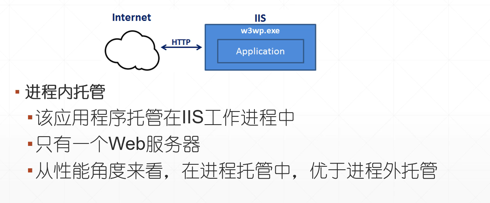
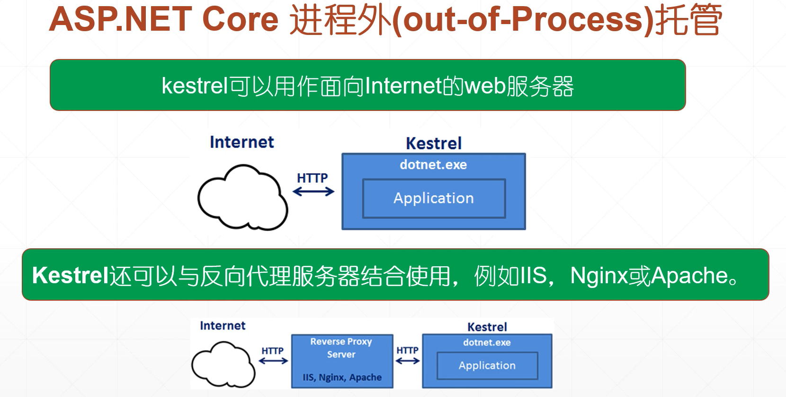
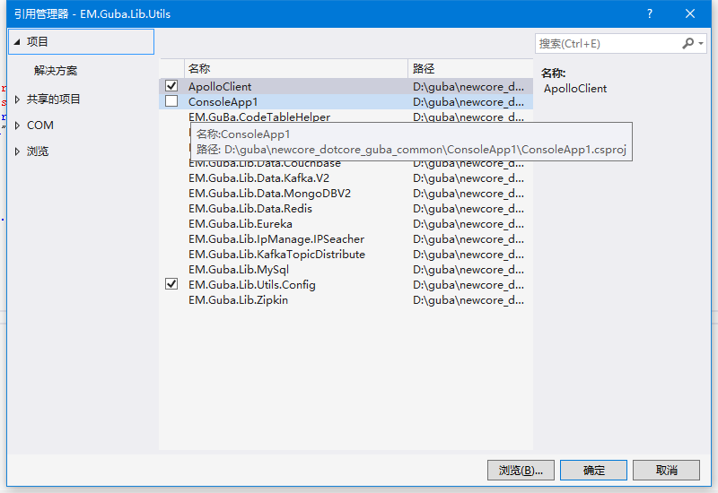
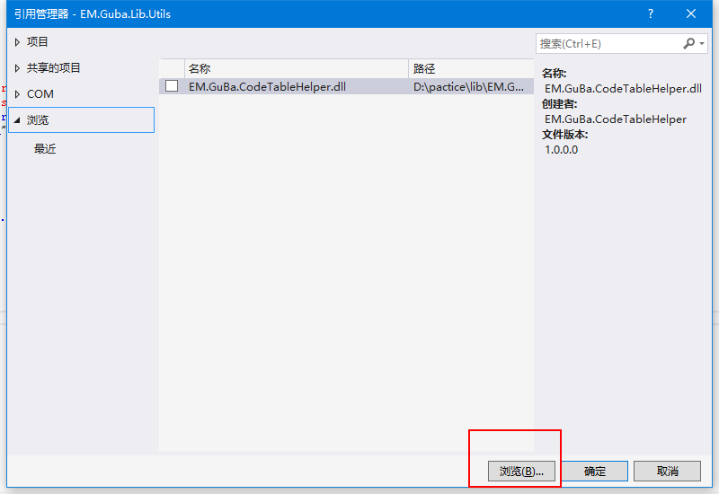
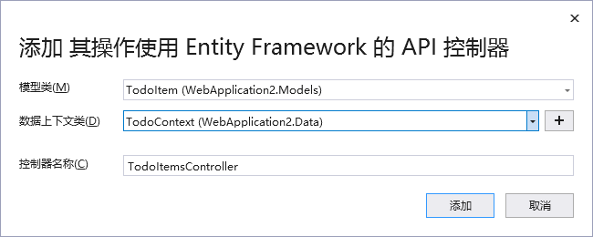
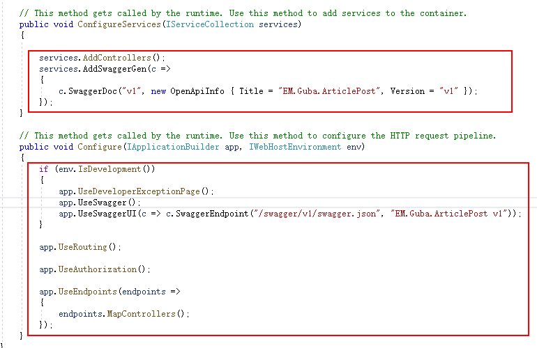
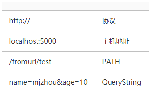

# ASP.NET Core项目文件

> 整个项目文件是以.csproj作为文件的扩展名的

```xml
<Project Sdk="Microsoft.NET.Sdk.Web">

  <PropertyGroup>
    //目标框架、选择托管形式 InProcess（进程内托管） OutOfProcess（进程外托管）、进程内托管比进程外托管提供了更高的请求吞吐量
    <TargetFramework>netcoreapp3.1</TargetFramework>
    <AspNetCoreHostingModel>InProcess</AspNetCoreHostingModel>
  </PropertyGroup>

  <ItemGroup>
    //用于包含对应用程序安装的nuget包的引用
  	<PackageReference></PackageReference>
  </ItemGroup>
</Project>
```

> 进程内托管



> 进程外托管




| 进程内                               | 进程外                              |
| ------------------------------------ | ----------------------------------- |
| 进程名称“w3wp.exe”或"iisexpress.exe" | 进程名称"dotnet.exe"                |
| 只有一个服务器                       | 两台服务器                          |
| 性能更好                             | 在内部和外部Web服务器之间代理请求的 |

# 项目结构解析

> Program.cs（项目入口）

```c#
//项目的主入口
public static void Main(string[] args)
{
    CreateHostBuilder(args).Build().Run();
}

//设置Web服务器，加载主机和应用程序配置表信息，配置日志记录
public static IHostBuilder CreateHostBuilder(string[] args) =>
    Host.CreateDefaultBuilder(args)
    .ConfigureWebHostDefaults(webBuilder =>
                              {
                                  webBuilder.UseStartup<Startup>();
                              });
```

> Startuo.css

```c#
public void ConfigureServices(IServiceCollection services);
```

1. mvc（下文中详解）
2. 添加依赖注入服务（将接口和实现类一一绑定）==低耦合、提供了高测试性，使单元测试更加容易==
   - services.AddSingleton
   - services.AddTransient
   - services.AddScoped

```c#
public void Configure(IApplicationBuilder app, IWebHostEnvironment env);
```


>  lauchSettings.json

```json
{
  "$schema": "http://json.schemastore.org/launchsettings.json",
  "iisSettings": {
    "windowsAuthentication": false,
    "anonymousAuthentication": true,
    "iisExpress": {
      "applicationUrl": "http://localhost:50571",
      "sslPort": 0
    }
  },
  "profiles": {
    "IIS Express": {
      "commandName": "IISExpress",
      "launchBrowser": true,
      "launchUrl": "weatherforecast",
        //生产环境
      "environmentVariables": {
        "ASPNETCORE_ENVIRONMENT": "Development"
      }
    },
    "EM.Guba.Backend.Share": {
      "commandName": "Project",
      "dotnetRunMessages": "true",
      "launchBrowser": true,
      "launchUrl": "weatherforecast",
      "applicationUrl": "http://localhost:5000",
        //生产环境
      "environmentVariables": {
        "ASPNETCORE_ENVIRONMENT": "Development"
      }
    }
  }
}

```

> ASP.NET Core 中的配置源：
>
> - appsettings.json，appsettings.{Environment}.json，不同环境中对应不同的托管环境
> - User secrets（用户机密）
> - Environment variables（环境变量）
> - Command-line arguments（命令行参数）

# 实际项目开发

> 添加依赖

- 依赖一般从common中进行引入
- 工具类库为EM.Guba.Lib.Utils
-  ==common中的依赖项并不会被打包成dll，所以业务模块中需要重新引入==
- 直接引入项目虽然可以运行但是文件打开速度会被拖慢



- 一般选用生成dll文件引入

生成dll步骤为对项目右键



> 项目结构

- model 实体类
- data 数据层操作（dao）
- core 业务层操作

> 返回的数据类型：

- JsonResult
- ObjectResult
- IActionResult view
  - 视图文件具有.cshtml的拓展名
  - 视图文件是带有嵌入Razor标记的HTML模板
  - 可能包含Controller提供给它的Model的业务数据

> controllers



# 难点

## ConfigureServices and Configure



> configureServices 是一个容器，所使用的服务及方法要添加到公共的容器之中， Configure是ConfigureServices中注册进来的所有服务要在Configure之中进行使用
>
> - 将所需的MVC服务添加到asp.net.core的依赖注入到容器中
> - 添加MVC中间件到我们的请求处理管道中


## AddMvc/AddMvcCore/AddControllers等区别

> 1. services.AddMvcCore()
>
>    - 只注册路由请求和执行控制器所必要的核心服务，确保Pipeline程序可运转。==提供的功能很少，需要DIY很多功能==
>
> 2. services.AddControllers()
>
>    - 除包含了AddMvcCore()所有功能，再加上：
>     - Authorization
>      - ApiExplorer
>      - Data Annotation
>      - Formatter Mapping
>      - CORS
> 
>    ==要用Controller但不用View，新建WebAPI时，默认采用==
>
> 3. services.AddRazorPages()
>
>    - 包含AddMvcCore()所有功能，再加上
>     - Razor Pages
>      - Authorization
>      - Data Annotation
>      - Cache Tag Helper
> 
> 4. services.AddControllersWithViews()
>
>    - 包含AddControllers()所有功能，再加上：
>     - cshtml和Razor View
>      - Cache Tag Helper
> 
>    ==标准MVC模式，常用Razor视图，使用这个足够==
>
> 5. services.AddMvc()
>
>    - 包含AddControllersWithViews()及AddRazorPages()功能。包含的功能最为齐全。


## 异步编程 async await

> 异步编程的本质就是新开任务线程来处理。通过Task.run()来实现。

执行await方法必须是async修饰的，并且返回类型为以下3种：

1. void
2. Task
3. Task<TResult>

异步执行后，返回的信息储存在result属性中。但主线程不会等待在await代码处，执行到await方法之后主线程继续往下执行，无需等待新的线程执行完成再继续。当需要用到新线程返回的result结果时，此时主线程才会等待新线程执行完并返回内容。

其中

1、**void**

如果在触发后，你懒得管，请使用 void。

void返回类型主要用在事件处理程序中，一种称为“fire and forget”（触发并忘记）的活动的方法。除了它之外，我们都应该尽可能是用Task，作为我们异步方法的返回值。

返回void，意味着不能await该异步方法，即可能出现线程阻塞，并且也无法获取exception抛出的异常，通常这些异常会导致我们的程序失败，如果你使用的是Task和Task<TResult>，catch到的异常会包装在属性里面，调用方法就可以从中获取异常信息，并选择正确的处理方式。

2、**Task**

你如果只是想知道执行的状态，而不需要一个具体的返回结果时，请使用Task。
与void对比呢，Task可以使用await进行等待新线程执行完毕。而void不需要等待。

3、**Task<TResult>** 

当你添加async关键字后，需要返回一个将用于后续操作的对象，请使用**Task<TResult>。**

主要有两种方式获取结果值，一个是使用Result属性，一个是使用await。他们的区别在于：如果你使用的是Result，它带有阻塞性，即在任务完成之前进行访问读取它，当前处于活动状态的线程都会出现阻塞的情形，一直到结果值可用。所以，在绝大多数情况下，除非你有绝对的理由告诉自己，否则都应该使用await，而不是属性Result来读取结果值。

总结：

==1、尽量优先使用Task<TResult>和Task作为异步方法的返回类型。==

==2、如果用了await则方法必须使用async来修饰，并且是Task的类型。==

## 控制器返回值

> ASP.NET Core 提供以下 Web API 控制器操作返回类型选项：
>
> - 特定类型
> - IActionResult
> - ActionResult<T>

1. 特定类型

```c#
[HttpGet]
public List<Product> Get() =>
    _repository.GetProducts();
```

上述操作不接受任何参数

2. 返回IEnumerable<T>或IAsyncEnumerable<T>

```c#
[HttpGet("syncsale")]
public IEnumerable<Product> GetOnSaleProducts()
{
    var products = _repository.GetProducts();

    foreach (var product in products)
    {
        if (product.IsOnSale)
        {
            yield return product;
        }
    }
}
```

> IEnumerable

```c#
///IEnumerable可枚举类型--可迭代类型
///IEnumerator枚举器
///Enum枚举
///
///只要一个类型实现了IEnumerable接口 就可以对他进行遍历
///yield 是一个迭代器，封装了IEnumerator枚举器
```

> 扩展方法

```c#
class Calculate
{
    public int Add(int a, int b){
        return a+b;
    }
}
static class CalculateNew
{
    public static int Addnew(this Calculate calculate, int a, int c){
        return a+b+c;
    }
}
```

> linq–数据查询语言

可以查询数组、list集合、数据返回类型是IEnumerable类型的

3. IActionResult

当操作中可能有多个 ActionResult 返回类型时，适合使用 IActionResult 返回类型。 

ActionResult 类型表示多种 HTTP 状态代码。 派生自 ActionResult 的任何非抽象类都限定为有效的返回类型。

 此类别中的某些常见返回类型为 BadRequestResult (400)、NotFoundResult (404) 和 OkObjectResult (200)。 或者，可以使用 ControllerBase 类中的便利方法从操作返回 ActionResult 类型。 例如，return BadRequest(); 是 return new BadRequestResult(); 的简写形式。

## 委托

对于委托的理解，就是函数可以作为参数进行传入，且函数多为lamba表达式的形式。

## mvc参数获取

http://localhost:5000/fromurl/test?name=mjzhou&age=10为例：



**通过QueryString获取参数**

1. Request.Query对象

```c#
        // /fromurl/test?name=mjzhou
        public IActionResult Test()
        {
            var name = Request.Query["name"];
            return Content(name);
        }
```

2. 自动参数绑定

如果Action的型参的名称跟QueryString的Key一致，则MVC框架会自动帮我们绑定参数的值，不用手动获取。

```c#
        // /fromurl/test?name=mjzhou
        public IActionResult Test1(string name)
        {
            return Content(name);
        }
```

如果参数绑定的名称跟QueryString的Key不一致，可以使用FromQueryAttribute强制指定绑定的Key的名称。

```c#
        public IActionResult Test2([FromQuery(Name = "id")]string bh)
        {
            return Content(bh);
        }
```

**通过PATH获取参数**

1. Request.Path对象

   Request.Path对象包含了本次http请求的Path的原始信息，一般可以通过/来分隔，手工获取想要的参数。

```c#
//      /fromurl/test3
        public IActionResult Test3()
        {
            var path = Request.Path;
            return Content(path);
        }
```

2. 自动参数绑定

```c#
//      /fromurl/Test4/mjzhou/1000
        [Route("FromUrl/test4/{name}/{id}")]
        public IActionResult Test4(string name, int id)
        {
            return Content($"{name}/{id}");
        }
//指定action接受的HTTP Method的方法
        [HttpGet("FromUrl/test5/{name}/{id}")]
        public IActionResult Test5(string name, int id)
        {
            return Content($"{name}/{id}");
        }
//如果定义的名称不一样，可以使用FromRoute强制指定解析的名称
        [Route("FromUrl/test6/{name}/{id}")]
        public IActionResult Test6([FromRoute(Name ="name")]string xm, [FromRoute(Name = "id")]int bh)
        {
            return Content($"{xm}/{bh}");
        }
```

**从Header上获取参数**

1. Request.Headers对象

Request.Headers是一个字典，包含了本次请求的Headers。所以我们可以通过Request.Headers对象轻松获取某个header的值。

```c#
        // /FromHeader/test
        public IActionResult Test()
        {
            var myName = Request.Headers["myName"];

            return Content(myName);
        }
```

2. 自动参数绑定

通过在action的型参上打上FromHeaderAttribute，可以告诉框架自动从header获取参数。

```c#
        public IActionResult Test1([FromHeader]string myName)
        {
            return Content(myName);
        }
```

如果action的型参跟header的key值不一致，可以通过FromHeaderAttribute强制指定匹配的header的key值。

```c#
        public IActionResult Test2([FromHeader(Name = "myName")]string name)
        {
            return Content(name);
        }
```

**从Body获取参数**

1. Request.Body对象

Request.Body是一个Stream，

```c#
public class model1
        {
            public string NAME { get; set; }
        }

        public async Task<IActionResult> Test()
        {
            Request.EnableBuffering();

            string body = "";
            var stream = Request.Body;
            if (stream != null)
            {
                stream.Seek(0, SeekOrigin.Begin);
                using (var reader = new StreamReader(stream, Encoding.UTF8, true, 1024, true))
                {
                    body = await reader.ReadToEndAsync();
                }
                stream.Seek(0, SeekOrigin.Begin);
            }

            var model = JsonConvert.DeserializeObject<model1>(body);

            return Content(model.NAME);
        }
```


